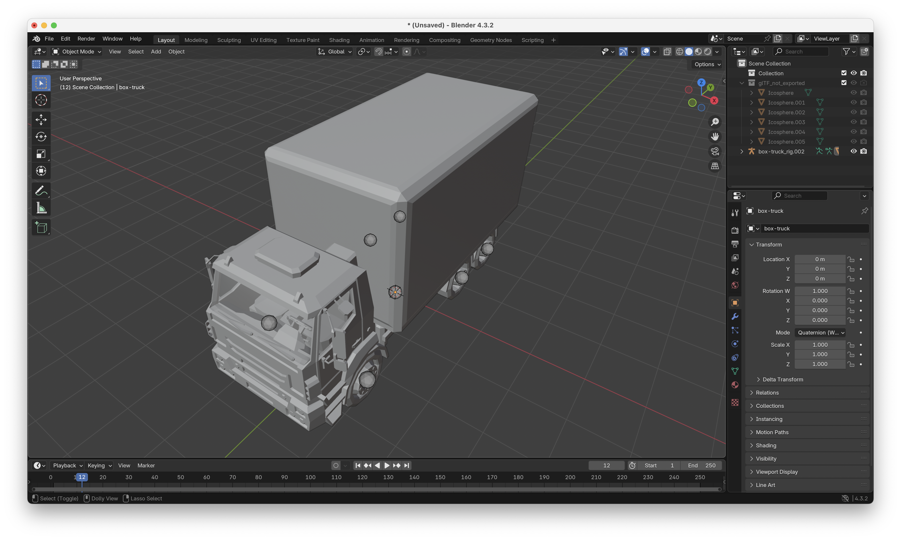

# Adding Vertex Colors for Custom Entity Colors

Vertex colors are used to allow for user-customized entity colors in the 3DStreet application. Blender is most easily used for the process of converting vertices from UV map to vertex colors.

1. Open the model in Blender (drag and drop the `.glb` file into Blender).


2. Switch to the UV Editing workspace tab. Make sure the "sync selection" feature is enabled (the button with two arrows in the top left of the UV Editor), and the shading mode is set to "Material Preview" (the sphere icon in the top right of the 3D viewport).


3. This part requires some guesswork - select the vertices that should be in their own material/color group by dragging a box around them in the UV map on the left side. It may help to change the selection mode between vertex, edge, and face selection modes (the three buttons in the top left of the 3D viewport).


4. With the vertices selected, open the Materials tab on the right and create a new material for the verticies by clicking the "+" button. Assign the new material to the selection by clicking "Assign".


5. Rename and reorder the materials as needed. For materials to automatically be colored inside of groups (such as vehicle paint or stripes), they must be named "Accent". Switch to the "Shading" workspace to verify the correct verticies are selected.


6. Export the model as a `.glb` file by going to `File > Export > glTF 2.0 (.glb)`. Make sure to check the "Vertex Colors" option in the export settings (the default settings is fine).


7. Run the compression pipeline:
	 ```bash
	 node gltf-build.mjs -i <INPUT-DIR> -o <OUTPUT-DIR>
	 ```
	 

8. Verify the model locally. The models can be served locally using npm:
	 ```bash
	 npm run serve
	 ```
	 Then set the `assets` URL in the 3DStreet application to `http://localhost:8000/`. The model should appear with the vertex colors applied.